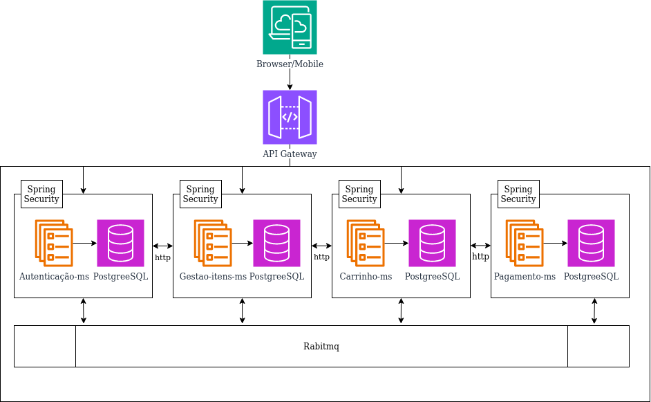
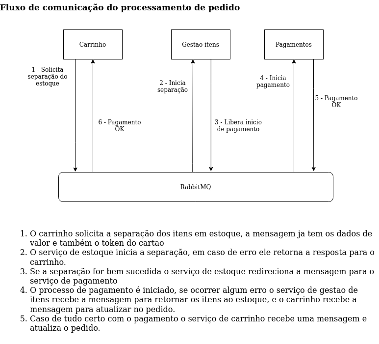

# Relatorio Tecnico Modulo5

## Tecnologias utilizadas
- Java 21
- Spring
- Postgres
- Docker
- Rabbitmq

Neste modulo o desafio foi criar o backend de um e-commerce simples, dividindo obrigatoriamente em microserviços, como podemos ver na imagem, as requests sao redirecionadas para o microserviço correto atravez de um gateway usando spring-cloud-gateway, apenas o gateway deve ficar exposto na internet, um ms se comunica com o outro usando o protocolo http, porem, no caso da transação de finalização de pedido a comunicação foi feita de forma assincrona com RabbitMQ, com isso alem de evitar que o usuario fique aguardando muito tempo e segurando a requisição eu tambem tenho mais tempo para realizar rollbacks em caso de erros dependendo de onde o problema aconteceu e garantir a integridade dos dados.

## Spring security
> Um dos requisitos era usar spring-security para cuidar da segurança das rotas, nesse projeto cada microservico recebe o jwt do api-gateway e se comunica com o ms-autenticacao para validar e recuperar dados do usuario.
>
> Optei por cada ms realizar a autenticação pois assim temos uma camada a mais de segurança mesmo sabendo que os ms sao acessiveis apenas na rede interna, uma vulnerabilidade no gateway poderia dar acesso aos microserviços de forma livre.

## Gateway
> Esse projeto apenas redireciona a requisição para o microserviço correto, se a requisição nao possuir o token jwt ela nem é repassada para os microserviços, com exceção das rotas de autenticação ou criação de usuario que permitem acesso sem token.

## Autenticação
>Nesse serviço é feito a autenticação e tambem o cadastro de usuarios, endereços e dados de contato, os outros microserviços se comunicam com esse para buscar os dados do usuario autenticado e validar permissoes.
## Gestão de itens
>Esse é o servico que controla os produtos do e-commerce, os administradores conseguem cadastrar itens e modificar o preço e suas quantidades se necessario, ja os usuarios normais conseguem listar os itens.
## Carrinho
>Esse serviço controla o carrinho do usuario e tambem finaliza o pedido, apos o usuario listar os itens disponives ele pode adicionar no carrinho contanto que respeite a quantidade total disponivel, adicionar no carrinho nao garante a disponibilidade do item no estoque pois o carrinho pode ficar muito tempo parado sem finalizar a compra, ao tentar finalizar a compra, se a quantidade do carrinho ja nao estiver mais disponivel, o usuario vai receber um erro no status do pedido.

## Pagamento (Simulação)
>O serviço de pagamento é apenas uma simulação, ele recebe os dados de cartao do usuario no momento em que o pedido é finalizado e gera um token para evitar transitar dados sensiveis de cartao entre os serviços, compras de DEBITO vao sempre ser concluidas e compras de CREDITO vao falhar.

## Desafios

Os desafios relevantes do projeto foram:

### Evitar race conditions na atualizacao das quantidades dos itens em estoque
>Toda transacao que envolve alguma alteração nas quantidades de estoque estao protegidas por um lock pessimista, evitando assim inconsistência nos dados.

### Transação de finalizar pedido
>A transação de finalizar pedido precisa garantir a integridade dos dados mas envolve outros dois microserviços, para garantir que a operação seja concluida ou que em caso de erro os serviços façam rollback se necessario, utilizei a comunicação assincrona com mensageria.

Ao finalizar um pedido temos duas etapas:
 - Validar se o estoque esta disponivel, em caso de falta no estouque precisamos apenas sinalizar erro no pedido.
 - Caso os produtos estejam disponiveis prosseguimos com o pagamento, se tudo der certo basta atualizar novamente o status do pedido, mas se der erro, precisamos retornar os itens para o estoque.

>Conforme demonstrado na imagem, em caso de erros em qualquer etapa do processo, o fluxo vai retornando e fazendo rollback se necessario, a estrutura foi baseada no padrao de SAGA coreografado.
